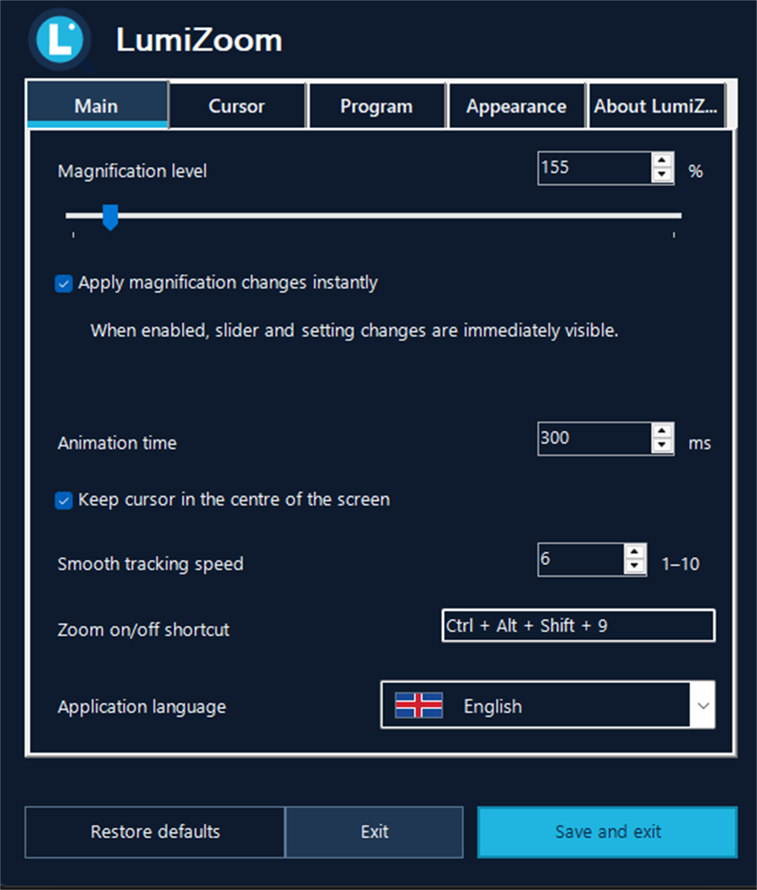
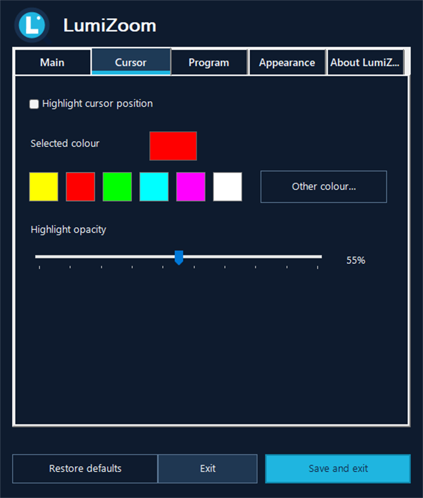
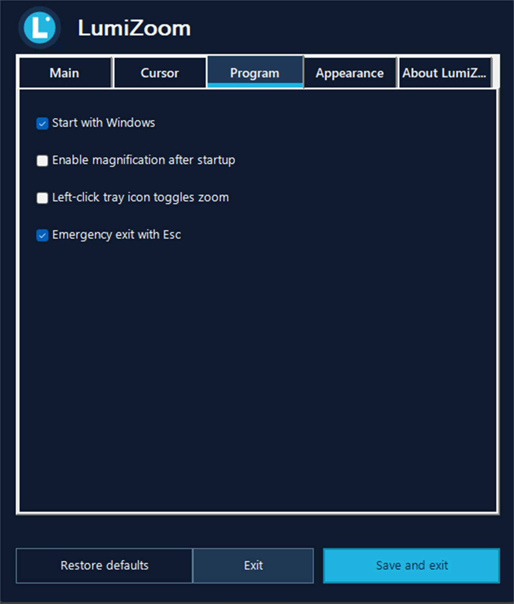
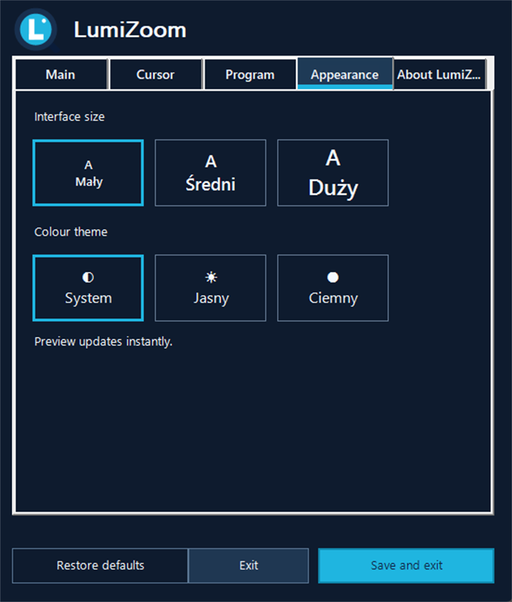
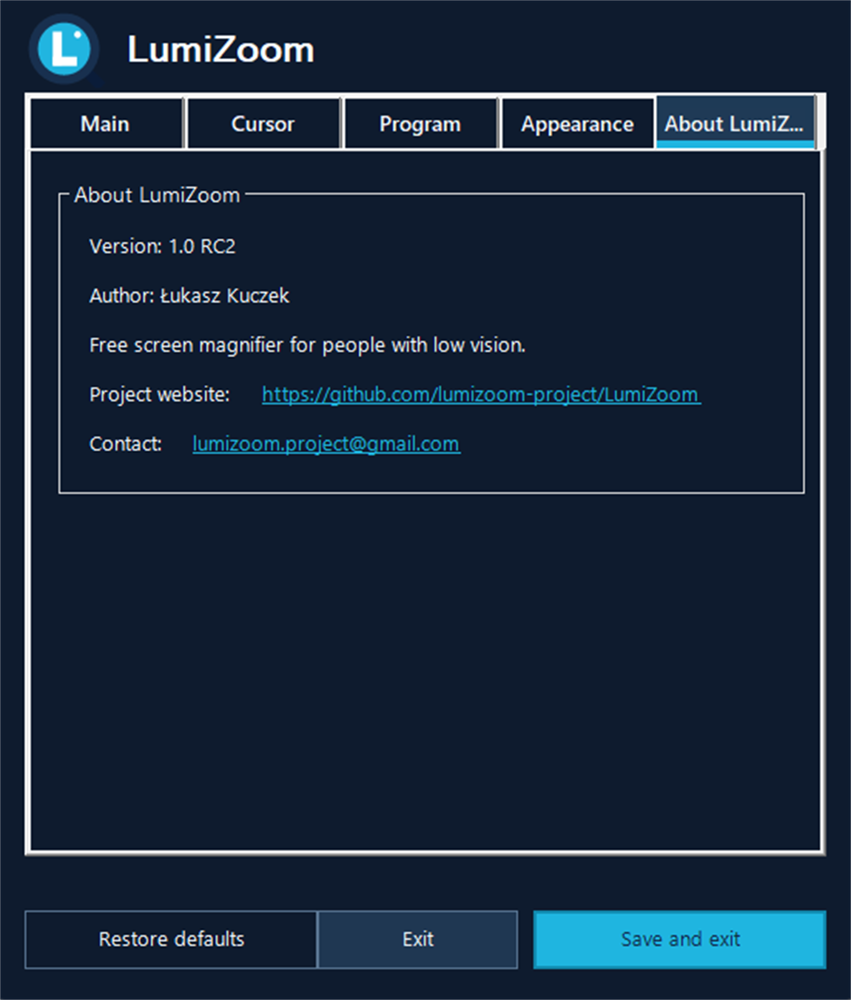

  

# LumiZoom

[Polski](README.pl.md) · **English**

LumiZoom is a free, open-source live screen magnifier for Windows. It is designed primarily for people with low vision and older computer users who need a simple, comfortable way to magnify the whole desktop without a permanent magnifier window.

## A screen magnifier made for everyday accessibility

Some screen-zoom tools are built mainly for presentations. During everyday use, Windows menus can sometimes be magnified a second time, making them difficult to read and use. LumiZoom was created for people with low vision who need a comfortable magnifier for working at the computer. It keeps desktop magnification consistent so the Start menu and other Windows menus remain readable.

## Highlights

- smooth full-screen zoom in and zoom out;
- configurable fixed zoom level;
- mouse pointer tracking with optional centre lock;
- configurable tracking speed and animation duration;
- optional coloured cursor highlight with adjustable colour and opacity;
- configurable global keyboard shortcut;
- light, dark and system themes;
- three interface font sizes;
- multilingual interface;
- tray icon operation and Windows startup enabled by default;
- emergency `Esc` key to leave magnification;
- single-instance protection.

## Screenshots

The screenshots show the English settings window; they focus on the app itself, not the full desktop.

  
  

  
  

  

## Download

### [Download the latest LumiZoom release for Windows 10/11 (64-bit)](https://github.com/lumizoom-project/LumiZoom/releases/latest)

The recommended installer is self-contained and does not require .NET to be installed separately.

- [Latest release and installer](https://github.com/lumizoom-project/LumiZoom/releases/latest)
- [All releases and older versions](https://github.com/lumizoom-project/LumiZoom/releases)
- [SHA-256 checksums](dist/SHA256SUMS.txt)

Windows may display a warning for early unsigned/publicly untrusted releases. The installer creates a local trusted certificate required by Windows UIAccess so mouse clicks remain correctly mapped while zoomed.

## Code signing policy

Release artifacts are built from the source code and build scripts in this repository. Release tags and checksums are published on GitHub. Until a publicly trusted signing certificate is available, Windows may show a SmartScreen warning for downloaded installers. LumiZoom does not ask users to disable Windows security features. Signing-related questions can be raised in [GitHub Issues](https://github.com/lumizoom-project/LumiZoom/issues).

## System requirements

- Windows 10 or Windows 11, 64-bit;
- administrator permission during installation.

The installer is self-contained and does not require a separate .NET installation.

Windows 7 is not supported by the current application platform and magnification input API.

## Default shortcut

`Ctrl + Alt + Shift + 9`

You can change it in **Settings → Main**.

## Building

1. Install the .NET 8 SDK.
2. Run `dotnet publish LumiZoom.csproj -c Release -r win-x64 --self-contained true`.
3. To build the Windows installer, install Inno Setup 6 and compile `LumiZoom.iss`.

## Privacy

LumiZoom has no telemetry, analytics, advertisements or online account requirement. See [Privacy](PRIVACY.md).

## Author and contact

Created by **Łukasz Kuczek**.  
Contact: [lumizoom.project@gmail.com](mailto:lumizoom.project@gmail.com)

## License

LumiZoom is released under the [MIT License](LICENSE).
